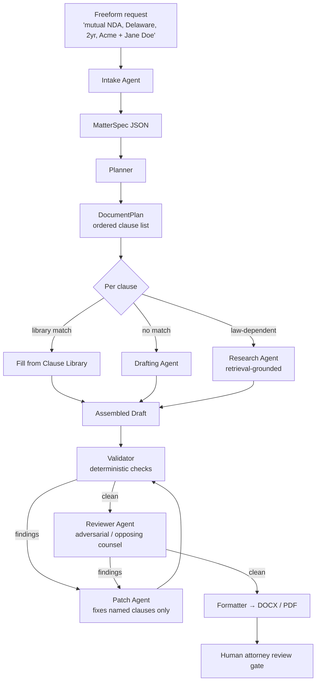

# Legal Document Agent System — Design

## 1. The core problem with the naive approach

The obvious design is "one big prompt → document." It fails on legal work for four specific reasons:

1. **Contracts are compositional, not generative.** A contract is a bundle of clauses. 80–90% of any given document is boilerplate with parameters. Generating that from scratch every time is expensive, slow, and non-deterministic — three properties you do not want in a legal instrument.
2. **Hallucinated law is a hard failure.** A wrong adjective is a style issue. A statute that doesn't exist is a liability event.
3. **Jurisdiction is a hard constraint, not a stylistic hint.** A non-compete clause that's fine in Texas is void in California. This is a lookup, not a judgement call.
4. **You need an audit trail.** "Why does the document say this?" must have an answer better than "the model chose to."

So the architecture below is **template-and-retrieval first, with LLM agents doing the parts that genuinely require reasoning**: understanding the request, drafting novel language, and adversarial review.

## 2. Pipeline



## 3. Agent roster

Lean on purpose. Every agent added is latency, cost, and a new failure mode. Five agents plus deterministic code covers it.

### 3.1 Intake Agent — *understand the ask*

**In:** one freeform paragraph. **Out:** a `MatterSpec` JSON object.

Its job is **not** to interrogate the user. It extracts what it can, applies sane defaults to what it can't, and records every guess in an explicit `assumptions[]` array. This is what makes the system one-shot by default: you always get a document on the first call, plus a list of what it had to assume.

It escalates to a question **only** when a term is material and undefaultable — usually the parties, the governing jurisdiction, and the consideration/price. Cap it at 3 questions, ever.

### 3.2 Planner — *choose the clauses*

Mostly deterministic. Given `(doc_type, jurisdiction, risk_posture)` it pulls a base template and resolves it against the **Clause Policy Matrix** (§5). Emits a `DocumentPlan`: an ordered list of sections, each tagged `library` / `draft` / `research`.

Only the "which optional clauses does this deal actually warrant" decision needs a model.

### 3.3 Drafting Agent — *write the language that isn't in the library*

Runs **per clause, in parallel**. Small, tightly scoped prompts: here is the clause slot, here is the spec, here is the house style, here are two examples of adjacent clauses. Never sees the whole document, so it can't drift.

Hard rule: it may not assert any proposition of law. If it needs one, it emits a `research_request` and the Research Agent handles it.

### 3.4 Research Agent — *ground anything law-dependent*

Retrieval only. Answers questions like "is a 3-year non-compete enforceable for a CA employee?" against a statute/caselaw corpus.

Hard rule: **no source, no claim.** If it can't cite, it returns `unknown`, and the orchestrator strips the dependent language and flags it for human review rather than letting the model fill the gap.

### 3.5 Reviewer Agent — *read it as opposing counsel*

Runs once, on a draft that has already passed the deterministic gate. Returns **structured findings**, never a rewritten document:

```json
{"clause_id": "7.2", "severity": "high", "type": "one_sided",
 "finding": "Indemnity runs only to Discloser; spec says posture=mutual.",
 "suggested_fix": "Mirror the obligation for Recipient."}
```

Findings route to the Patch Agent, which edits *only the named clauses*. See §4.

### 3.6 Not an agent: the Validator

**This is the most important design call in the document.** Most of what people build as a "validation agent" should be plain code:

| Check | Implementation |
|---|---|
| Placeholder leakage (`[PARTY]`, `TBD`) | regex |
| Defined terms used but never defined | parse `"X" means` + capitalised-token scan |
| Defined terms defined but never used | same |
| Cross-references to non-existent sections | parse + graph check |
| Numbering gaps / duplicates | walk the tree |
| Party names inconsistent | string set |
| Dates that don't order (term ends before it starts) | date math |
| Amounts: words vs. digits disagree | number parse |
| Required clauses missing for this jurisdiction | Clause Policy Matrix lookup |
| Forbidden clauses present | Clause Policy Matrix lookup |

Every one is fast, free, and 100% reliable. An LLM does all of them at ~95% reliability, for money, slowly. Reserve the model for the genuinely semantic check — "does clause 7 contradict clause 12?" — and run that as part of the Reviewer.

Rule of thumb: **if a check can be written as an assertion, it must not be an agent.**

### 3.7 Formatter

Deterministic. Template → DOCX/PDF: numbering scheme, TOC, defined-terms index, signature blocks, exhibits. Use `docx`/`docxtpl`; do not have a model produce markup.

## 4. The revision loop — patch, don't regenerate

The failure mode of naive review loops is non-convergence: the model rewrites the whole document to fix one clause, which breaks two others, which triggers new findings, forever.

Fix: findings are **addressed to clause IDs**, and the Patch Agent is given only that clause plus its dependencies. The rest of the document is byte-identical between iterations.

- Deterministic validator: runs every iteration (it's free).
- Reviewer: runs on a clean draft, max 2 passes.
- Loop cap: 3. On exhaustion, ship the draft with unresolved findings attached as a review memo rather than looping forever.

## 5. The Clause Policy Matrix — jurisdiction rules as data

Keyed on `(doc_type, jurisdiction, clause_id)`:

```yaml
- doc_type: employment_agreement
  jurisdiction: US-CA
  clause_id: non_compete
  rule: forbidden
  authority: "Cal. Bus. & Prof. Code § 16600"
  note: "Void except narrow sale-of-business exception."

- doc_type: nda
  jurisdiction: US-CA
  clause_id: trade_secret_carveout
  rule: required
  authority: "18 U.S.C. § 1833(b) (DTSA whistleblower notice)"
```

Why this matters: it's **auditable, editable by a lawyer who doesn't touch prompts, and deterministic**. Jurisdiction logic buried in a system prompt is untestable and silently drifts between model versions. Here it's a table you can diff, review, and unit-test.

## 6. The Clause Library is the actual asset

Agents improve slowly (you're waiting on model releases). The clause library improves every time someone uses the system.

Each entry: `id`, `text` (with typed slots), `doc_types[]`, `jurisdictions[]`, `posture` (pro-discloser / mutual / pro-recipient), `tags[]`, `provenance`, `last_reviewed_by`, `last_reviewed_at`.

**Capture the feedback loop from day one:** when a human edits generated output, diff it against what was produced and offer the delta back as a library revision. Six months of that beats any amount of prompt tuning.

## 7. Interface

One entry point. Everything else is optional detail.

```python
doc = legalapp.draft(
    "Mutual NDA between Acme Inc (Delaware) and Jane Doe, "
    "2 year term, covers product roadmap discussions."
)

doc.text            # the document
doc.assumptions     # what intake had to guess
doc.open_questions  # what it couldn't resolve
doc.findings        # unresolved reviewer findings
doc.save("nda.docx")
```

CLI:

```
$ legalapp draft "mutual NDA, Delaware, 2yr, Acme Inc + Jane Doe"
✓ Drafted: Mutual Non-Disclosure Agreement (Delaware)  [nda.docx]

  Assumptions (3)
    • Term: 2 years from Effective Date; survival 3 years post-term
    • Governing law: Delaware (from Acme's state of incorporation)
    • Notice: email permitted

  Open questions (1)
    • Jane Doe's notice address not supplied — placeholder inserted

$ legalapp revise nda.docx "make the term 3 years and add a non-solicit"
```

UI: a single textarea, a document pane, and a right-hand rail with three collapsible sections — Assumptions, Open Questions, Findings. Each item deep-links to the clause it affects. That rail *is* the product; the document is table stakes.

### MatterSpec — the contract everything speaks

```json
{
  "doc_type": "nda",
  "jurisdiction": "US-DE",
  "parties": [
    {"role": "discloser", "name": "Acme Inc", "entity_type": "corporation", "state": "DE"},
    {"role": "recipient", "name": "Jane Doe", "entity_type": "individual"}
  ],
  "posture": "mutual",
  "terms": {"duration_months": 24, "survival_months": 36, "purpose": "product roadmap discussions"},
  "required_clauses": [],
  "excluded_clauses": [],
  "assumptions": [
    {"field": "terms.survival_months", "value": 36, "basis": "default for mutual NDA"}
  ],
  "open_questions": [
    {"field": "parties[1].notice_address", "why": "not supplied", "blocking": false}
  ]
}
```

One JSON object, versioned, is the seam between every component. A spec is reusable, diffable, and storable — "same NDA but Texas law" is a one-field edit and a re-run, not a new conversation.

## 8. Model routing

| Stage | Model | Why |
|---|---|---|
| Intake | small/fast | structured extraction |
| Planner | small/fast | mostly lookups |
| Clause fill (library match) | none — code | pure substitution |
| Drafting novel clauses | frontier | this is the hard part |
| Research | frontier + retrieval | precision matters |
| Reviewer | frontier | adversarial reasoning |
| Validator | none — code | assertions |
| Formatter | none — code | templating |

Most of a typical run is code. That's the point: it makes the system fast, cheap, and reproducible, and concentrates model spend where reasoning actually happens.

## 9. Guardrails

- **Attorney review gate.** Output is a draft for review, never a filed or executed instrument. Ship it with that framing in the product, not just in a footer.
- **No unsourced legal propositions.** Enforced structurally (§3.4), not by asking the model nicely.
- **Full provenance.** Every clause records its origin: library ID + version, or generated (with the spec hash and model version). "Why does it say this?" always has an answer.
- **Immutable run log.** Spec, plan, clause sources, findings, and human edits, retained per matter.
- **Confidentiality.** Matter content is client-confidential; decide retention/training policy explicitly before onboarding a real user.

## 10. Build order

1. `MatterSpec` schema + Intake Agent. Prove one paragraph → clean spec.
2. Deterministic Validator. Cheap, immediately useful, and it de-risks everything downstream.
3. Clause Library + Formatter for **one** document type (NDA — small, well-understood, high volume). End-to-end on one doc type beats half of five.
4. Reviewer Agent + patch loop.
5. Clause Policy Matrix, seeded with 2–3 jurisdictions.
6. Research Agent — last, because it needs a real corpus and is the easiest to get dangerously wrong.
